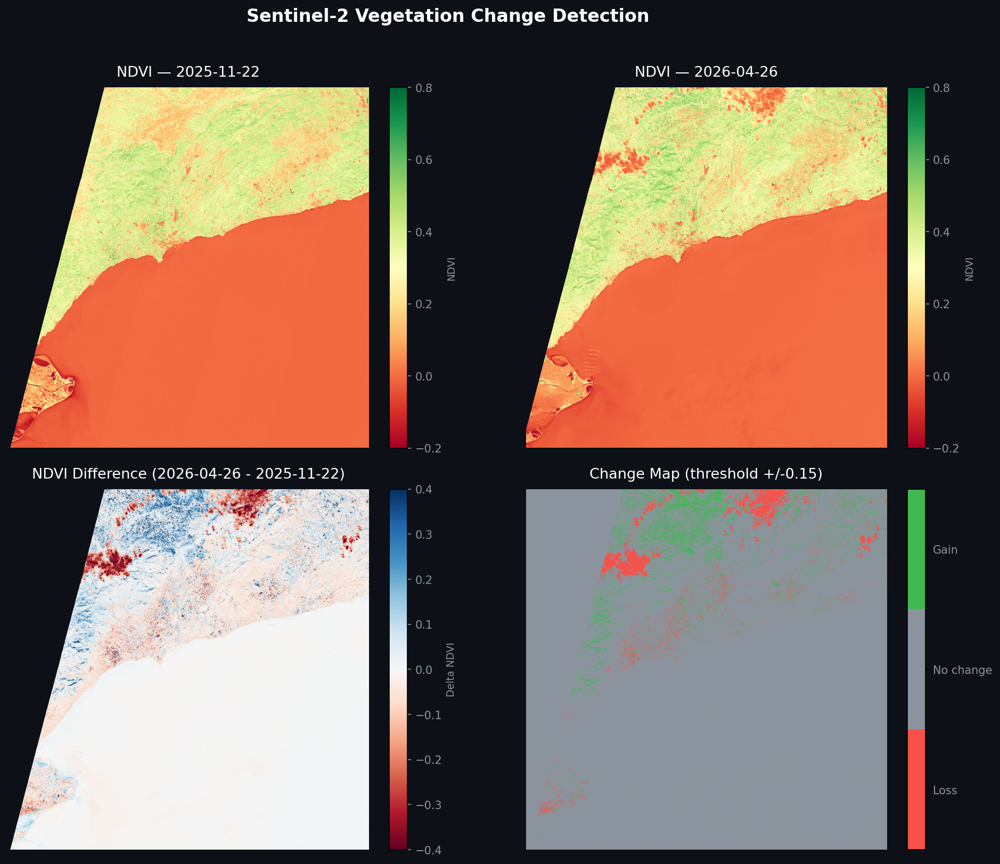

# Sentinel-2 Vegetation Change Detection

Remote sensing project for detecting vegetation change between two dates using Sentinel-2 L2A bands (`B04` and `B08`), computing NDVI, classifying change, and producing geospatial outputs ready for GIS analysis.



## Analysis Objective

The main goal is to build a reproducible and explainable workflow that can:

- measure temporal variation in vegetation cover/activity,
- identify areas with vegetation loss, stability, or gain,
- deliver quantitative and visual outputs in a reusable format.

This repository is designed as a practical and maintainable remote-sensing workflow: it not only runs the analysis, but also demonstrates a clean architecture (influenced by SOLID principles) to support extension and long-term reuse.

## Why This Project Is Useful

This project demonstrates more than just "running NDVI":

- **Earth observation domain awareness:** understanding of spectral bands, temporal comparison, and geospatial outputs.
- **Engineering discipline:** modular architecture, typed protocols, test coverage, and documented assumptions.
- **Communication ability:** results are presented in both machine-consumable formats (GeoTIFF) and stakeholder-friendly format (summary figure + statistics).

In practical terms, this type of workflow is useful for:

- environmental monitoring,
- land management and planning,
- agriculture and vegetation stress screening,
- detecting potentially relevant change areas before deeper investigation.

## Methodological Basis (NDVI)

NDVI is computed as:

```text
NDVI = (NIR - Red) / (NIR + Red)
```

Where:

- `B04` = Red band
- `B08` = Near-infrared band (NIR)

These band assignments are defined by the official Sentinel-2 MSI spectral specification:

- `B04` is centered in the red region of the spectrum,
- `B08` is centered in near-infrared (NIR),
- both are provided at 10 m spatial resolution in Sentinel-2 L2A products.

Why this matters:

- vegetation tends to absorb red light (photosynthetic activity),
- vegetation tends to strongly reflect NIR,
- the contrast between red absorption and NIR reflectance is what makes NDVI informative.

General interpretation:

- high NDVI values are typically associated with denser / healthier vegetation,
- low or negative values are typically associated with bare soil, water, urban surfaces, or strongly degraded vegetation.

Typical NDVI ranges (rule-of-thumb, context dependent):

- **< 0.0**: water, clouds, shadows, snow, or non-vegetated surfaces.
- **0.0 to 0.2**: bare soil / sparse vegetation.
- **0.2 to 0.5**: moderate vegetation.
- **> 0.5**: dense and active vegetation.

Important caveats when interpreting NDVI:

- NDVI is not a direct biomass measurement; it is a proxy.
- seasonality and phenology can produce legitimate changes unrelated to disturbance.
- clouds, haze, shadows, and aerosols can bias pixel values.
- sensor/view geometry and atmospheric conditions can influence comparability.

## Workflow Followed (Step by Step)

1. **Raster data loading**  
   Two scenes covering the same area are read (two different dates), extracting bands `B04` and `B08` for each date.

2. **NDVI calculation per date**  
   An NDVI map is computed for each date with numerical handling for invalid divisions.

3. **Temporal difference**  
   `diff = NDVI_date_2 - NDVI_date_1` is computed to capture continuous pixel-by-pixel change.

4. **Threshold-based classification**  
   The continuous difference is converted into discrete classes:
   - `-1`: vegetation loss (`diff < -threshold`)
   - `0`: no significant change (`|diff| <= threshold`)
   - `+1`: vegetation gain (`diff > threshold`)

5. **Output export**  
   GeoTIFF files are written for NDVI date 1, NDVI date 2, NDVI difference, and the classified change map.

6. **Descriptive statistics**  
   Pixel counts and percentages are reported by class to interpret change magnitude.

7. **Final visualization**  
   A 4-panel figure is generated for fast review and result communication.

## Why Temporal Comparison Adds Value

A single-date NDVI map tells "what vegetation looks like now."  
A two-date NDVI comparison tells "how vegetation changed over time."

This distinction is operationally valuable because change detection helps prioritize action:

- where to inspect potential degradation,
- where vegetation recovery might be occurring,
- where conditions remain stable and may need less intervention.

In short, temporal differencing converts static EO snapshots into decision-oriented insights.

## Project Architecture

```text
soil_changes_sentinel_2/
├── main.py                    # Minimal entrypoint: builds and runs the pipeline
├── soil_change/
│   ├── __init__.py
│   ├── config.py              # Configuration dataclasses and default paths
│   ├── protocols.py           # Contracts (Protocol) for DIP
│   ├── services.py            # Concrete implementations (IO, NDVI, classification, plots)
│   └── pipeline.py            # Workflow orchestration + dependency injection
├── data/
│   └── 10m/                   # Input Sentinel-2 bands
├── outputs/                   # Generated results (GeoTIFF + PNG)
├── tests/                     # Unit tests (unittest, synthetic data, no raster files needed)
├── requirements.txt
└── README.md
```

### Why this architecture?

- It separates technical responsibilities by module.
- It allows components to be replaced without rewriting orchestration.
- It improves readability for technical review and team collaboration.

## Libraries and Their Purpose

- `numpy`: core numerical engine for pixel-wise array operations (NDVI math and classification).
- `rasterio`: geospatial raster IO (read JP2, write GeoTIFF, preserve CRS/transform metadata).
- `matplotlib`: visual communication layer (4-panel figure for quality check and reporting).
- `geopandas` *(optional)*: prepared for vector overlays / geospatial enrichment in future expansions.
- `jupyter` *(optional)*: exploratory analysis and experimentation workflow.

This stack balances:

- reproducibility,
- geospatial correctness,
- and clarity of communication.

## Installation

```bash
pip install -r requirements.txt
```

## Configuration

Edit `soil_change/config.py`:

- `DATE_1`: label and `B04` / `B08` paths for the baseline date.
- `DATE_2`: label and `B04` / `B08` paths for the comparison date.
- `change_threshold` in `DEFAULT_CONFIG` to tune sensitivity.

Expected input pattern:

```text
data/10m/<date_folder>/<band_file>.jp2
```

## Run

```bash
python main.py
```

Results will be generated in `outputs/`.

## Unit Tests

This project includes unit tests implemented with Python's built-in `unittest` framework.
The test suite is fast, deterministic, and based on synthetic in-memory arrays so it does not depend on external Sentinel files.

### What is covered

- `tests/test_services.py`
  - `NDVICalculator.compute`: validates NDVI math and zero-denominator handling (`NaN`).
  - `ThresholdChangeClassifier.classify`: validates loss/stable/gain assignment from threshold rules.
  - `ConsoleStatsReporter.print_change_stats`: validates printed class summaries and no-valid-pixel edge case.
- `tests/test_pipeline.py`
  - `ChangeDetectionPipeline.run`: validates orchestration behavior using test doubles (reader/writer/classifier/plotter/reporter), including read order, output names, and downstream calls.

### Run the tests

```bash
python -m unittest discover -s tests -p "test_*.py" -v
```

## Generated Outputs

The pipeline intentionally generates four complementary outputs:

1. `ndvi_<label>.tif` (date 1): baseline vegetation state.
2. `ndvi_<label>.tif` (date 2): comparison-date vegetation state.
3. `ndvi_difference.tif`: continuous change magnitude and direction (`date_2 - date_1`).
4. `change_map.tif`: thresholded semantic classes (`-1`, `0`, `+1`) for easier interpretation and reporting.

Additionally:

- `change_detection_results.png` combines all products in a single visual dashboard for quick review.

Why these outputs together:

- **Per-date NDVI rasters** preserve full information for independent analysis.
- **Difference raster** exposes nuanced gradient changes that class labels might hide.
- **Classified map** simplifies communication to non-specialists and supports KPI-style summaries.
- **Dashboard figure** speeds up QA and technical communication.

## Primary Conclusions (Current Run)

With the configuration and data currently included in the repository, the resulting statistics are:

- **Vegetation loss:** 36,199,811 px (**30.0%**)
- **No significant change:** 84,197,376 px (**69.8%**)
- **Vegetation gain:** 163,213 px (**0.1%**)

Initial interpretation:

- Spatial stability dominates the scene (almost 70%).
- There is a relevant proportion of vegetation loss (~30%) that deserves geographic inspection.
- Detected gain is marginal compared with the loss signal.

> Technical note: these conclusions are sensitive to cloud contamination, seasonality, acquisition geometry, and the chosen threshold. For operational decision-making, cloud/SCL masking and additional validation are recommended.

## Limitations and Quality Considerations

Current implementation is intentionally clear and educational, but should be strengthened for production use:

- no explicit cloud/shadow masking yet (SCL integration recommended),
- no atmospheric quality filtering beyond source product assumptions,
- two-date comparison only (longer time series would improve robustness),
- no uncertainty quantification yet.

These limitations are documented by design to show critical thinking and transparent engineering judgment.

## Data Source

Sentinel-2 L2A products are available from [Copernicus Data Space](https://dataspace.copernicus.eu/).

Images used in this project were downloaded from Copernicus Data Space with the following search filters:

- **Satellite mission:** Sentinel-2
- **Product level:** L2A *(Level-2A; atmospherically corrected surface reflectance product)*
- **Cloud cover filter:** up to 10%
- **Geographic zone:** area covering Delta de l'Ebre and Camp de Tarragona
- **Acquisition dates used in this analysis:** 2025-11-22 and 2026-04-26

Recommended good practices for robust comparisons:

- same tile and geographic extent,
- low cloud coverage in both dates,
- comparable phenological / seasonal context whenever possible.

## Suggested Future Improvements

- Cloud / shadow masking using the SCL band.
- Multi-index analysis (NDWI, NBR, NDBI) for stronger robustness.
- Batch execution for longer time series.
- Unit tests with synthetic rasters.
- CLI parameterization (paths, threshold, output).

## License

MIT
